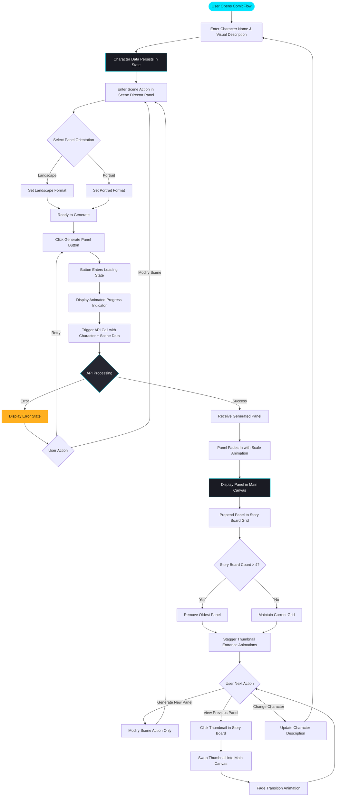
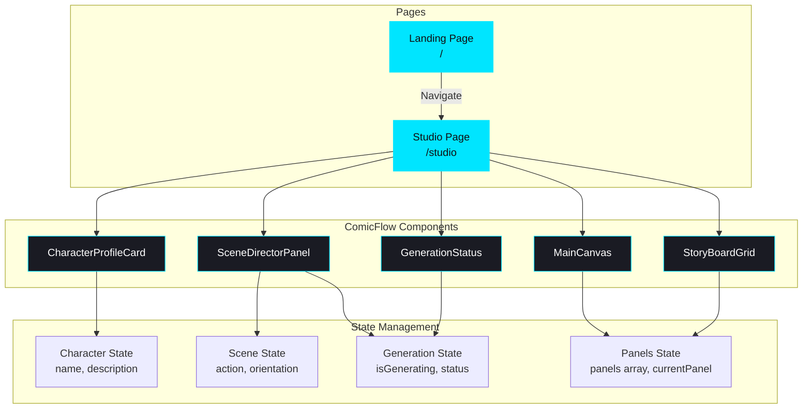
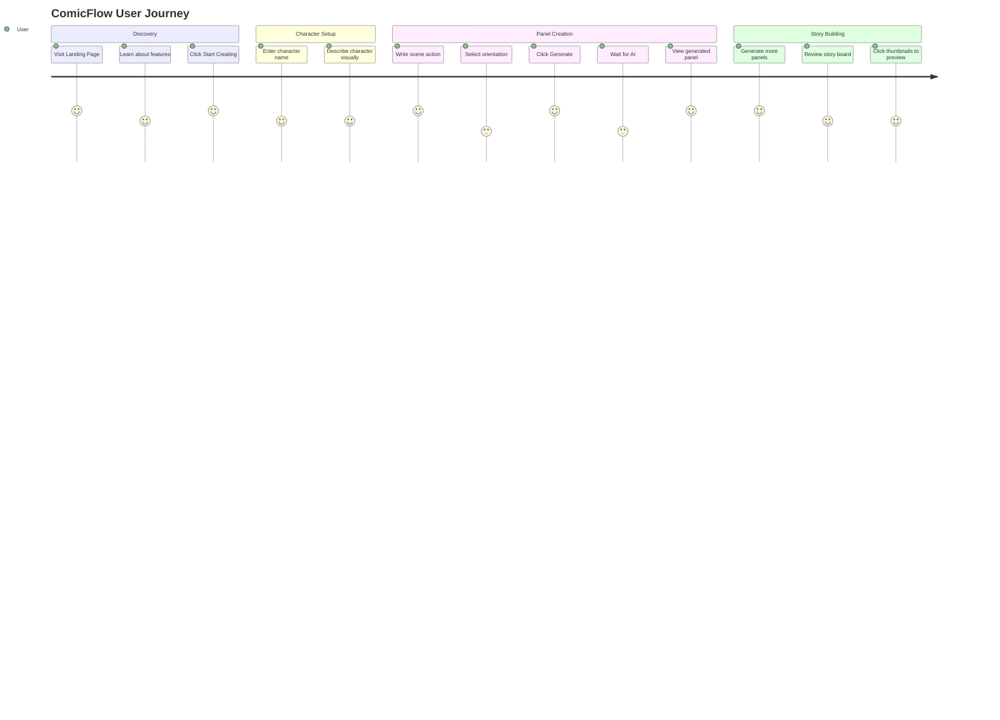
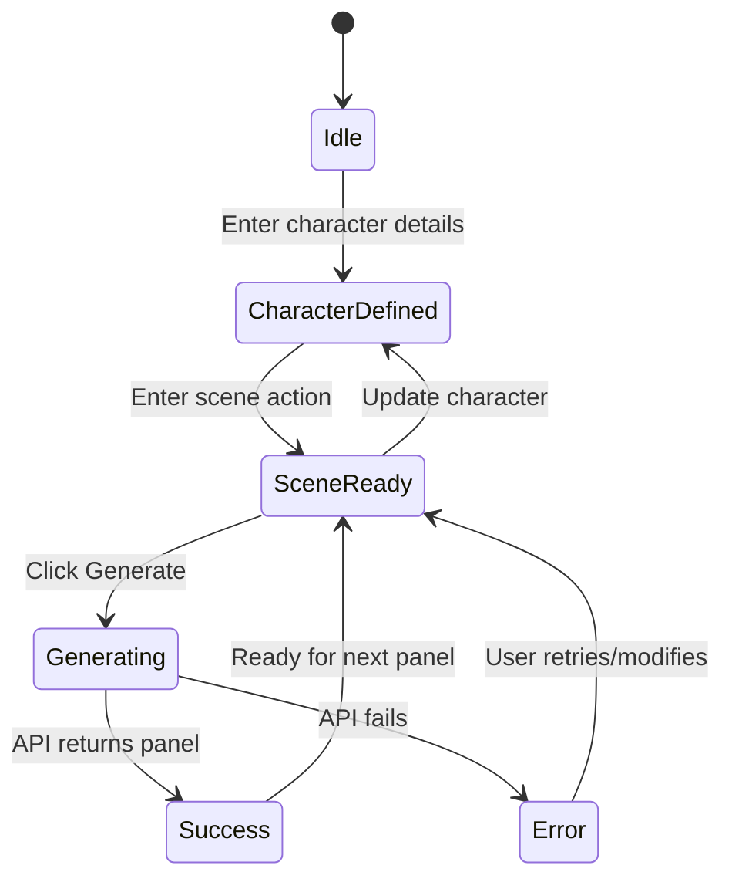

# ComicFlow 🎨

**Narrative Comic Creation Studio** — AI-powered comic panel generation for storytellers, illustrators, and parents creating magical stories for children.


## 🌟 Overview

ComicFlow is a professional comic panel generation tool that maintains visual consistency across narrative sequences. Users define a character once, then generate multiple comic panels showing that character in different scenarios while preserving their visual identity throughout the story.

## ✨ Features

- **Character Consistency** — Define your character's visual DNA once and maintain it across all panels
- **Scene Director** — Describe actions and scenarios for each panel
- **Orientation Control** — Switch between landscape and portrait formats
- **Story Board Grid** — View and manage your last 4 generated panels
- **Real-time Generation Status** — Animated feedback during AI processing

## 🎯 Design Philosophy

**Modern Editorial meets Neo-Brutalism** — A dark, studio-grade interface that balances professional sophistication with bold, graphic clarity. Think Figma's precision meets comic book energy.

### Color System
- **Background**: Deep charcoal `#0F0F12`
- **Primary Accent**: Sharp cyan `#00E5FF`
- **Warning/Progress**: Warm amber `#FFB020`
- **Cards**: Blue-gray tint `#1A1B23`
- **Inputs**: Elevated surface `#252630`

### Typography
- **Display**: `Syne` at 800 weight — geometric brutalism
- **Interface**: `Space Grotesk` at 500/600 — technical yet friendly
- **Body**: `IBM Plex Mono` at 400 — studio/technical vibe

## 🔄 Application Flow



## 🏗️ Component Architecture



## 🎬 User Journey



## 🔧 State Flow



## 📁 Project Structure

```
src/
├── app/
│   ├── page.tsx          # Landing page
│   ├── studio/
│   │   └── page.tsx      # Comic creation studio
│   └── globals.css       # Global styles & animations
├── components/
│   ├── comicflow/
│   │   ├── CharacterProfileCard.tsx
│   │   ├── SceneDirectorPanel.tsx
│   │   ├── MainCanvas.tsx
│   │   ├── StoryBoardGrid.tsx
│   │   └── GenerationStatus.tsx
│   └── ui/               # ShadCN components
└── lib/
    └── utils.ts
```

## 🚀 Getting Started

```bash
# Install dependencies
npm install

# Run development server
npm run dev

# Open http://localhost:3000
```

## 🎨 Key Interactions

| Interaction | Animation |
|-------------|-----------|
| Panel Generation | Radial pulse from button |
| New Panel Appears | 400ms fade-in + scale (0.95 → 1.0) |
| Thumbnail Entrance | 80ms stagger delay |
| Hover States | 200ms spring + subtle scale (1.02) |
| Canvas Active | 4px cyan border glow |

## 🖼️ Screenshots

### Landing Page
- Floating navigation header
- Hero section with animated elements
- Feature cards with hover effects
- Example gallery with zoom interactions

### Studio
- Two-column layout (40/60 split)
- Character Profile Card (left sidebar)
- Scene Director Panel with orientation toggle
- Main Canvas with active border
- Story Board Grid timeline

## 📝 License

MIT License — Built with ❤️ for storytellers everywhere.
